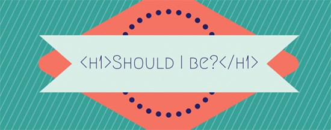
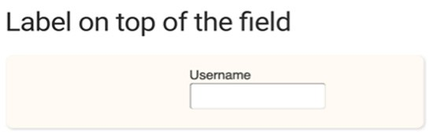
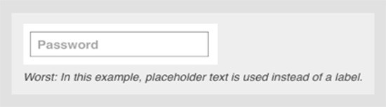

<!--
    N.T.: "How to make your wireframes more accessible in five easy steps" foi
        traduzido para "Wireframes mais acessíveis em 5 passos fáceis", pois desta forma
        a palavra wireframes fica mais visível (@ivans-netto, 10-13-2016 15:40).
-->

A maioria dos websites na América do Norte e Europa agora precisam adequar-ser aos requerimentos de acessibilidade.
Estes incluem requerimentos descritos pela Section 508 of the <am lang="en">American Disabilities Act (ADA)</am>.
Eles também referenciam para o <am lang="en">Web Content Accessibility Guidelines (WCAG 2.0)</am>.

Siga estes 5 fáceis passos para fazer seu wireframe mais acessível:

1. Documente a estrutura dos títulos;
2. Documente hidden way-finding cues;
3. Documente a ordem do focus e especifique o estado visível deste;
4. Forneça links claras para os labels;
5. Faça o design simples e de formas utilizáveis.

Um: Documente a estrutura de títulos
-----------------------------------

Lembra-se da última vez que escreveu uma redação? Você provavelmente tinha uma série de sessões na sua redação e em cada uma delas um título.
Mais provável tinha um índice que listava estes títulos.
Se alguém lesse seu índice, teria uma boa idéia sobre o que sua redação se trata.

Isto é o que títulos são para os websites.
Eles devem descrever a página que estão.
Dispositivos de acessibilidade como leitores de tela permitem usuários navegar as webpages pelos títulos.
Ouvir os títulos permite os usuários identificar rapidamente se a página é útil para eles.
Se os títulos não são desenvolvidos e escritos em uma forma clara e própria para,
eles não irão auxiliares para os usuários que fazem uso destas ferramentas de leitura.

<!--
  N.T: O trexo abaixo é o HTML original. Vamos manter esse comentário até que
       nosso site tenha exibir imagens com redimencionamento automatico. Eu
       achei maravilhoso isso.
       (@fititnt, 2016-10-04 17:45)

  
-->

O designer de experiência ou escritor deve decidir as estruturas de títulos.

O wireframe ou matriz de conteúdo deve incluir a anotação que descreve a estrutura de títulos.
O desenvolvedor não deve decidir a estrutura de títulos por ele mesmo (na ausência de documentação).

Dois: Document hidden way-finding cues
-------------------------------------

Usuários de leitores de telas são beneficiados pelo way-finding cue para ajudar na navegação da webpage.
Estes incluem:

-   "Blocos de escape (Bypass)":  Estes permitem ao usuário do leitor de tela escapar dos possíveis blocos repetidos de conteúdo.
    Sem eles, estes usuários teriam de utilizar a tecla "tab" repetitivamente nos blocos de conteúdo da página.
    Ele são os mais utilizados para escapar da navegação do menu.
    Outros candidatos para o bypass incluem filtros para menus, carrousels e muitos outros tipos de conteúdo.
-   Blocos de bypass podem ser escondidos por padrão, mas devem aparecer no foco do teclado.
    Eles devem permitir o usuário a escapar o bloco de conteúdo atual para o imediatamente próximo.
    É importante testar estes com um teclado, uma que estão implementados.
    Tenha certeza que você pode utilizar o tab uma vez para a area de conteúdo,
    e também novamente para o próximo objeto interativo dentro desta mesma area, se houver.

Três: Documentar a informação de ordem de foco e especificar o estado do foco visível
---------------------------------------------------------------------------

### Ordem de foco

Ordem de foco é um importante conceito para a acessibilidade no teclado.
Isto referencia a ordem dos elementos na página que recebe o foco do teclado.
A ordem de foco comum para Western worl é: do topo para baixo, esquerda para direita, da mesma forma que lemos.

Para usuários de teclado, a forma comum de acessar um website é mover-se através do conteúdo pressionando a tecla tab.
A tecla tab move o estado de foco para links e elementos de formulários.
Usuários de leitores de tela podem ter seus dispositivos lendo uma página em qualquer ponto desta.

Normalmente experiências beneficiam-se com a implementação padrão da ordem de foco.
Porém existem casos quais a ordem de foco deverá ser mudada.
Isto será melhor determinado por um UX Designer ou UX Developer.

O seguinte fluxo ilustra uma situação onde a ação do tab padrão dele ser sobrescrita:

-   O usuário clica em um link para logar em um site e tal link leva para um página diferente.
-   Por padrão, a primeira area de foco na página seria provavelmente no topo esquerdo - link relevante ou campo do formulário.
    Mas neste momento, o usuário está definitivamente lá para logar-se.
    Faz sentido aqui colocar o estado de foco primeiramente no campo de cadastro do formulário.

De novo, isto não pode ser decidido por um desenvolvedor na ausência de documentação.
Deve está anotado no wireframe guia.

### Estado de foco visivel

Um estado de focos visivel é um indicador visual que o elemento selecionado está sob foco.
É como para designers criar um estado de hover para o mouse dos usuários.
Geralmente o estado de foco deve combinar com o de hover.

Para desenvolvedores criarem este estado nas suas implementações, este deve estar definido no wireframe.
Adicionalmente, o design do foco de cada elemento deve ser descrito um um styleguide.
Cada browser tem seu próprio estilo de foco.
Ou permita o estilo do browser ser utilizado ou um designer deve criar um novo que combine com a marca do cliente.

Muitos clientes não entendem o valor de um estado de focos visivel.
Então isto é descrito em um styleguide, onde o cliente tem o oportunidade de ver na sua frente e perguntar sobre.

> What is a visible focus state?
>
> Try it out on my website: Press your tab key now and try to see what the current focused element is on the site.
> You will see that my navigation links along the top of the site get underlines,
> and other links change color and have an outline.
> This is so keyboard users can see where the focus is.

Quatro: Forneça labels claros
-------------------------------

Usuários quais navegam com leitores de tela, muitos deles não vão apenas ouvir os labels.
Eles não tem qualquer contexto em torno da informação.
É importante fazer claro os labels por si próprios (ou por form field label), isto é significativo.

Fazer: Aprender mais sobre nossos serviços

Não fazer isto: Aprenda mais

Fazer: Editar minha conta

Não fazer isto: Editar

Algumas vezes o contexto é claro para o usuário baseado no conteúdo ao redor.
Neste caso, indique no wireframe que o desenvolvedor deve esconder conteúdo adicional para usuários sem dificuldades visuais.
Deste maneira, um usuário sem dificuldades visuais qual ganha informações do contexto ao redor verá "Aprende mais".
Um usuário com dificuldades visuais irá ouvir "Aprende mais sobre nossos serviços".

Five: Design simple, usable forms
---------------------------------

### Útil para designers

Eu frequentimente pergunto aos designers se eles planejam enviar seus form designs para o cobiçado From Design Awards.
Normalmente eles me olham fixo inexpressivamente.
Às vezes eles animamam-se e perguntam por mais informações sobre este prêmio.

Não existe Form Desgin Awards. Não é ótimo?
Nós podemos pôr nossas metas estéticas de lado e focar em fazer um form mais utilizável.
Confie em mim: formuálios são para serem preenchidos.
Trust me: forms are meant to be filled out. Eles não precisam ser chamativos.
Está tudo bem se eles não forem ultra clean e lustroso.

Aqui estão algumas das boas práticas que também fazem seu formulário acessível.

-   Colo um label acima do campo do formuário, não ao lado;
-   Coloque um "campo requerido" indicador;
    Também de grande ajuda colocar "opcional" nos campos opcionais
-   Não troque campos do formulário por placeholders de textos (marcadores de texto).
    Usuários de todas as idades e habilidades reclamam sobre isto.
    Textos em placeholders desaparecem quando o usuário clica dentro do campo para começar a digitar.
    Pode ser dificil de lembrar o que o conteúdo do campo pede (Ex: Email vs nome de usuário);
-   Se os campos não tem um label visivel (ex: campos de busca),
-   If fields do not have a visible label (e.g. search fields), providencie um label oculto.
    Indica-se o texto do label. Todos os campos de formuário devem ter labels.

*Veja este artigo:* *[O guia definitivo para o
posicionamento de labels](http://www.sitepoint.com/definitive-guide-form-label-positioning/)*

*From the Nielsen Norman Group article:*
*[Design de placeholders
de formuários](https://www.nngroup.com/articles/form-design-placeholders/)*

### Mensagens de erros acessíveis

Leitores de tela automaticamente leem campos de labels do formuários quando o campo está sob foco.
A mensagem de erro de fluxo deve funcionar assim:

-   Usuário preenche de uma forma errada;
-   Usuário tenta submitar o formuário;
-   O primeiro campo do formulário com uma mensagem de erro deve automaticamente ficar sob o foco do teclado.
-   A mensagem de erro deve ser programada para aparecer no campo do label.

Desta maneira, um leitor de tela irá ler o formulário seguindo a mensagem de erro.
Exemplo: "Endereço de Email. Endereço de email é um campo requerido".
O usuário pode arrumar o erro, então dar tab para o restante do formulário e ouvir as outras mensagens de erros durante este percurso.

<!--
  N.T: O trexo abaixo é o HTML original. Vamos manter esse comentário até que
       nosso site tenha suporte a declarar links que abram em nova janela
       (@fititnt, 2016-10-04 17:43)

  
<a href="http://webaim.org/techniques/forms/" target="_blank">WebAIM has a great article about accessible form developmentOpens in a new window</a>    that I encourage everyone to read.

-->

[WebAIM é um ótimo artigo sobre desenvolvimento de formulários acessiveis](http://acessibilidade.pt.webiwg.org/webaim/tecnicas/formularios/)
que eu incientivo todos a lerem.

Você pode estar interessado neste artigos mencionados sobre experiência do usuário acessível:
--------------------------------------------------------------------------------------

-   [Criar experiência acessíveis começa com o experience
    design](http://accessib.li/2016/05/14/creating-accessible-experiences-starts-with-experience-design/)
-   [Por que a conformidade da acessibilidade deve ser um critério nos prêmios
    de web design](http://accessib.li/2016/04/22/why-accessibility-compliance-should-be-a-criteria-in-web-design-awards/)
-   [Usuablidade deve incluir
    acessibilidade](http://accessib.li/2016/03/18/usability-should-include-accessibility/)

Faça me saber [sessão de comentários](http://accessib.li/2016/08/28/how-to-make-your-wireframes-more-accessible-in-five-easy-steps/#respond)
quais features de acessilibade você adiciona nos seu formulários.
