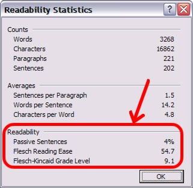
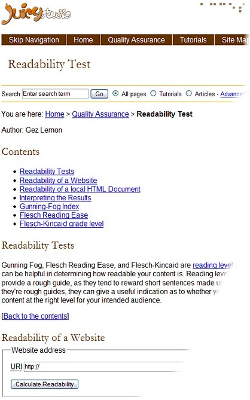

<!--
 N.T: Temos um problema, que precisa ser visto com autor original.
      Neste artigo, não tem uma data de ultima atualização. (fititnt, 2016-10-09 19:15)
-->

<!-- Geração automática de índice, inicio -->
<nav markdown="1">

## Índice de tópicos
{:.no_toc}

- Indice de Tópicos. Esta linha será substituída
{:toc}

</nav>
<!-- Geração automática de índice, fim -->

<!--
  N.T.: Não estou certa se "Clearly and Simply" possui um significado subjetivo além do literal 
        (@icoffani, 2016-10-11 15:24)
-->

É *possível* escrever de forma "Simples e Clara"?
-----------------------------------------------

A tarefa de escrever de forma clara e simples nunca foi nem clara e nem simples.
Na verdade, ela pode ser uma das tarefas mais difíceis relacionadas à escrita.
Escrita clara e simples é uma arte à qual muitos se aspiram, porém poucos a atingem.
Ainda assim, o entendimento do conteúdo da web depende de uma escrita clara e simples.
A escrita, quando não é clara e é confusa, é uma barreira de acessibilidade a todos os leitores,
mas pode ser ainda mais difícil para pessoas que tenham dislexia ou pessoas com distúrbios
cognitivos.

<!--
  N.T.: As traduções das citações foram retiradas das traduções já realizadas por terceiros por
  se tratarem de sentenças de pessoas famosas já traduzidas anteriormente.
        (@icoffani, 2016-10-18 23:36)
-->

> "O meu objetivo é colocar no papel aquilo que vejo e aquilo que sinto da mais simples 
e melhor maneira."  
> —Ernest Hemingway

> "A menos que você seja um gênio, dedique-se a ser inteligível."  
> —Anthony Hope Hawkins

**Diferenças culturais e de linguagem importam.**
Para complicar a situação, as “regras” para escrita de forma clara e simples em inglês podem não se aplicar de
forma alguma a outras línguas, ou até mesmo entre culturas que falam a mesma língua.
Em muitos países em que se fala o Inglês, é valorizada uma comunicação escrita que seja direta e explícita.
Outras culturas sentem que esse estilo seja muito grosseiro, e até mesmo ofensivo aos leitores.

Apesar das dificuldades em definir o significado da escrita “clara e simples”,
as sugestões nesta seção ainda podem beneficiar redatores de conteúdo para web.
As sugestões servem como orientações generais para escrever em Inglês de forma clara e simples,
primeiramente a partir de uma perspectiva do Inglês Americano.
Aqueles que escrevem em outras línguas deverão procurar recursos que se apliquem especificamente àquelas
línguas.

**Habilidades cognitivas importam.**
Nem todo mundo tem o mesmo nível de leitura ou tem a habilidade de entender os conteúdos dos textos,
mesmo quando estes são apresentados de forma clara e simples.
Dislexia, distúrbios de memória, distúrbios de déficit de atenção,
e outras condições que afetam os processos cognitivos do cérebro podem comprometer a habilidade de uma 
pessoa de se beneficiar com o texto.
As orientações apresentadas abaixo vão melhorar a leitura para muitas pessoas, mas pode não ser 
aplicável para todas.

Orientações Gerais
------------------

As orientações apresentadas aqui não são uma lista completa,
também não se aplicam a toda situação, mas são um bom ponto de partida. 
Escritores que levam estas orientações a sério têm maior probabilidade de escrever de forma clara e simples.

### 1. Organize suas ideias em um esboço lógico – antes e durante o processo de escrita

Esta pode ser a orientação mais importante de todas.
Você tem de pensar claramente sobre um tópico a fim de poder comunicá-lo claramente.
O processo de organização é contínuo,
começando antes de qualquer palavra ser escrita e continuando através de todo o processo.
Não há nada de errado em reorganizar um papel conforme você o escreve.
Quando você acredita ter terminado,
aproveite a oportunidade de analisá-lo mais uma vez para ver se a organização faz sentido para você.
Se ela faz, ótimo! Se não fizer, tente novamente!

Aqui estão algumas ideias de escritores bem-sucedidos sobre a necessidade de organizar as ideias:

> "Se qualquer homem deseja escrever de forma clara, deixe-o antes ser claro em seus pensamentos."  
> —Johann Wolfgang von Goethe

> "Escrever é mais fácil se você tiver algo a dizer."  
> —Sholem Asch

### 2. Diga aos seus leitores o que você irá dizer a eles; diga a eles; depois diga a eles o que você disse a eles

A fórmula a ser seguida é começar com uma introdução ou uma visão geral das ideias do artigo, 
explicar as ideias no corpo principal do texto e, então, resumir ou revisar as ideias no final.

Exemplo

De forma simplificada, aqui está uma análise estrutural de ideias para um artigo sobre calvície:

**Introdução (Diga aos leitores o que você irá dizer a eles)**

Nem todo mundo aprecia a calvície da forma como deveriam.
Há vantagens em ser calvo.

**Corpo (Diga a eles)**

**Ideia Principal 1:**
Pessoas calvas não têm de se preocupar com o custo de cortes de cabelo.
Eles podem cortar seu próprio cabelo (o que tiver sobrado dele) com uma tesoura ou navalha.

<!--
  N.T.: o verbo "style" possui diversas aplicações no português no contexto inserido, tais como: pentear,
  fazer escova, realizar um penteado, etc. Dessa forma, foi escolhida a palavra que mais se aproxima do 
  sentido de todos os aplicáveis ao verbo citado.
        (@icoffani, 2016-10-18 00:03)
-->

**Ideia Principal 2:**
Pessoas calvas não precisam pentear seu cabelo.
Eles só têm de secar a sua cabeça com uma toalha após o banho,
e estão então livres para seguir para outras atividades mais relevantes,
tais como ler quadrinhos, praticar ioga ou escalar árvores.

**Ideia Principal 3:**
Mesmo em dias de vento, as pessoas calvas nunca têm cabelos caindo em seus olhos ou em suas bocas,
ao menos não os seus próprios,
o que torna dias de vento mais suportáveis para a vasta maioria das pessoas que não gosta do sabor
de cabelo.

**Revisão e Conclusão (Diga a eles o que você disse a eles)**

A calvície permite algumas conveniências na vida que normalmente são pouco apreciadas,
em termos de cortes de cabelo, estilo e em dias de vento. Você deveria considerar a possibilidade
de ser calvo.

### 3. Atenha-se ao ponto

Quando mais você se afasta de seu ponto principal, menor será a probabilidade de as pessoas
lembrarem dele.

### 4. Torne-o interessante

Prenda a atenção dos seus leitores através da inclusão de detalhes relevantes que os motivem a 
continuar lendo.

Aqui estão algumas ideias de indivíduos famosos sobre a importância de tornar as coisas interessantes:

> "Se você não quer ser esquecido quando morrer, escreva coisas que valham a pena serem lidas ou faça coisas
que valham a pena escrever a respeito."  
> —Benjamin Franklin

> "A imaginação é mais importante que o conhecimento.” "
> —Albert Einstein

> "O que queremos é uma história que comece com um terremoto e que chegue ao clímax pouco a pouco."  
> —Samuel Goldwyn

### 5. Escreva para seu público-alvo

Você deve escrever de modo diferente para uma classe de alunos de primeira série e para um comitê de
estudantes pós-graduados. 
Além disso, você deve levar em conta as áreas de competência das pessoas,
mesmo que elas tenham o mesmo nível de educação ou de inteligência.
Diferenças culturais e de gênero também podem desempenhar um papel ao definir o público-alvo.
À medida que você seguir em sua escrita, mantenha as características de seu público em mente
e escreva de acordo.

### 6. Assuma que seus leitores são inteligentes, mas não assuma que eles saibam sobre o tema tão bem quanto você

A quantidade de explicação que você necessita dar depende de quão familiar o seu público é com o
tópico em questão. 
Explicar conceitos não é um insulto; é benéfico,
desde que as explicações mostrem que você respeita o leitor.
Algumas pessoas com distúrbios cognitivos podem necessitar de mais explicação do que outras,
mas quando você escreve para o público em geral, assuma um nível de inteligência genérico a eles.

Alguns especialistas dizem que os escritores devem almejar uma linguagem em sua escrita de “nível
de oitava série”.
É difícil determinar com certeza o que isso significa. Muitas revistas populares,
tais como a “Reader’s Digest” e a “Ladies’ Home Journal” são escritas em torno desse nível. 
Fontes de notícias, como a “Newsweek”, são escritas em um nível ligeiramente maior, aproximando-se de 
linguagem do primeiro ano do ensino médio (décimo ano de estudo).

<!--
  N.T.: o décimo ano de estudo (10th grade) corresponde ao primeiro ano do ensino médio no Brasil.
        (@icoffani, 2016-10-18 00:17)
-->

### 7. Escreva parágrafos com coesão, construídos em torno de uma ideia única e principal

Todas as ideias de um parágrafo devem remeter ao ponto principal.
Se possível, coloque a ideia principal do parágrafo na primeira frase.

Exemplo

O parágrafo a seguir apresenta uma ideia sobre equipes.
A primeira frase claramente aponta a ideia principal do parágrafo (“Obstáculos são uma
realidade constante para as equipes”). 
Conforme você prosseguir com a leitura deste parágrafo,
note como as outras frases dele reforçam a ideia principal da primeira frase.

> **Obstáculos são uma realidade constante para as equipes.**
Eles ocorrem a partir do momento que uma equipe em potencial se junta até o final desta equipe.
Obstáculos também diferem tanto quanto as equipes, os desafios de performance, os ambientes 
organizacionais e os contextos de negócios que os produzem.
A equipe “Burlington Northern Intermodal”, por exemplo, encontrou pouco apoio da gestão,
políticas contra publicidade, falta de confiança de caminhoneiros e o talento medíocre no departamento intermodal.
Ela também confrontou mau tempo, competição intensa e uma economia empobrecida quando teve de provar sua estratégia
com os dois novos núcleos. 
Quaisquer desses obstáculos poderia impedir o progresso e a performance da equipe.
Nenhum deles o fez. De fato, trabalhar com os obstáculos tornou a equipe mais forte.

(De “A Sabedoria das Equipes”, por Jon R. Katzenbach e Douglas K. Smith. HarperBusiness press 1994, página 149.)

### 8. Evite gírias e jargões

Gírias e jargões podem ser úteis às pessoas que os entendem, porém podem ser confusos para aquelas que 
não entendem.

Exemplo

**Jargão computacional:**
Algumas empresas de software emitem demos de crippleware.
Outras emitem shareware ou nagware. Outras ainda não emitem nada, a não ser vaporware.

As palavras "crippleware," "demos," "shareware," "nagware," and "vaporware,"
são familiares a muitas pessoas na indústria computacional,
mas significam pouco ou nada para pessoas que não são familiarizadas com os termos.

**Jargão de teoria social:**
A teoria crítica procura problematizar a reificação hegemônica de constructos sociais estratificados opressivos.

A frase acima descreve com precisão um aspecto do movimento social conhecido como teoria crítica,
mas utiliza termos que são de certa forma menos comuns fora da teoria crítica,
e os quais tem significados específicos dentro da perspectiva teórica.
A frase utilizada como exemplo pode confundir as pessoas que não tem familiaridade com a teoria crítica.

### 9. Utilize palavras comuns e combinações de palavras

Escritores devem empenhar-se em se comunicar com seus leitores,
e não em impressioná-los utilizando palavras incomuns ou chamativas.

Example

**Palavras que não são comuns (a muitas pessoas):**
A legião populosa dos andarilhos impecuniosos congregou-se nas proximidades da basílica.

**Palavras mais comuns:**
A grande multidão de pessoas pobres e desabrigadas se juntou nas proximidades da velha igreja.

### 10. Utilize a voz ativa

A voz passiva enfraquece a ação de uma frase por distanciar a ação dos sujeitos que a estão realizando.
A voz ativa liga o sujeito diretamente à ação.

Exemplo

**Passive:**

-   A refeição foi comida na festa pelos convidados.
-   Um bom momento foi tido por todos.
-   O resultado da construção de uma estrada através do terreno agrícola foi a busca no aumento de lucro por alguns donos de propriedades e a eventual perda de terras adjacentes à estrada para os projetos de construção residencial e comercial dos contratantes.

**Active:**

-   Os convidados comeram a refeição na festa.
-   Nós tivemos um bom momento. OU Nós nos divertimos.
-   Construir uma estrada através do terreno agrícola foi a causa de alguns donos de propriedades buscarem lucro através da venda de suas terras a contratantes que eventualmente construíram projetos residenciais e comerciais em terras adjacentes à estrada. 

### 11. Evite verbos fracos

Escritores com frequência utilizam o verbo “ser/estar” (é, são, eram, foram) quando, na verdade, verbos ativos
podem ser mais apropriados.
O uso excessivo do verbo “ser/estar” muitas vezes força os escritores a utilizarem a voz passiva mais do que
o necessário.
O verbo “ser/estar” sugere passividade porque ele conecta duas entidades que são essencialmente iguais.
A frase “A é B” essencialmente significa que “A é igual a B”.
A relação entre A e B é estática.
Em contrapartida, outros verbos – tais como “melhorar”, “esclarecer”, “modificar” ou “destruir” – implicam em um maior relacionamento dinâmico entre A e B.

Exemplo

**Verbo fraco ("ser"):**
Um modo de melhorar sua escrita é utilizar verbos fortes.
(A = B)
(Um modo de melhorar sua escrita = utilizar verbos fortes)
A igual relação entre as duas partes da frase implica em nenhuma ação.

**Verbo forte ("melhorar"):**
Utilizar verbos fortes pode *melhorar* sua escrita.
(A melhora B)
O sujeito da frase ("utilizar verbos fortes") realiza a ação de *melhorar* o objeto da frase ("sua escrita").

### 12. Utilize-se da construção de frases paralelas

Tenha certeza de que a construção da frase é consistente consigo mesma.

Exemplo

**Construção não-paralela:**
A nova máquina de seleção dele economiza tempo, aumenta o lucro e a satisfação do trabalhador.

**Construção paralela:**
A nova máquina de seleção dele economiza tempo, aumenta o lucro e aumenta a satisfação do trabalhador.

Nota

Um modo de descobrir se a frase contém uma construção paralela é listar cada um dos itens, um de cada vez, em uma
frase completa:

1.  A nova máquina de seleção dele economiza tempo.
2.  A nova máquina de seleção dele aumenta o lucro.
3.  A nova máquina de seleção dele a satisfação do trabalhador.

A terceira frase neste exemplo obviamente necessita de um verbo para tornar a frase completa e paralela às frases 
anteriores.

### 13. Utilize termos positivos

Enfatize como as coisas são, foram, serão ou seriam.
Até o máximo possível, evite o uso de *não são, não foram,* e outras palavras que estruturem uma frase a partir da
perspectiva como as coisas não são, não foram, não serão ou não seriam.

Exemplo

**Termos negativos:**

-   Não se suje.
-   Não se esqueça de regar as flores.
-   Eu não lembrei onde estive na noite passada..
-   Membros do coral não deveriam cantar de formas que não se misturem ao restante do coral.

**Termos positivos:**

-   Mantenha-se limpo.
-   Lembre-se de regar as flores.
-   Eu esqueci onde estive na noite passada.
-   Membros do coral deveriam cantar de formas que se misturem ao restante do coral.

### 14. Dê instruções diretas

Instruções diretas podem aumentar a compreensão e colocar um senso de responsabilidade maior no leitor.

Exemplo

**Instruções indiretas:**

-   Estudantes devem ler o capítulo cinco.
-   É melhor tomar um café-da-manhã saudável antes de deixar a sua casa pela manhã.
-   Pode ser perigoso tentar andar na corda bamba esticada sobre um fosso de crocodilos famintos, então esta prática é altamente desestimulada.

**Instruções diretas:**

-   Leiam o capítulo cinco.
-   Tome um café-da-manhã saudável antes de deixar sua casa pela manhã.
-   Não ande na corda bamba sobre um fosso de crocodilos famintos.

### 15. Evite múltiplas negações

A maioria dos leitores considera negações duplas,
ou múltiplas negações, um pouco estranhas, o que pode levar a confusão ou, no mínimo, reduzir a compreensão.

Exemplo

**Dupla negação:**

-   Não se esqueça de não abrir sua boca quando você cair em uma poça de lama.
-   Eu não os deixo não ajudar com os afazeres.

**Negação única ou frase somente positiva:**

-   Não abra sua boca quando você cair em uma poça de lama.  
    **OU**  
    Mantenha sua boca fechada quando você cair em uma poça de lama.
-   Eu não os deixo evitar os afazeres.  
    **OU**  
    Eu me certifico de que eles ajudem com os afazeres.

### 16. Evite acrônimos e abreviações, se possível; forneça uma explicação a todos os acrônimos e abreviações

Acrônimos incomuns e abreviações não têm significado para os leitores.
Expandir os acrônimos e as abreviações permite que os leitores aprendam seus significados.
Isso é particularmente verdade na primeira vez, ou nas primeiras vezes, em que um acrônimo ou abreviação são
utilizados.

Exemplo

**Acrônimos e abreviações sem explicação:**
A professora teve de preparar um PEI para as crianças com DA e teve de cumprir com as regs. do NCDT de forma 
a atingir os reqs. do PAA.

<!--
  N.T.: As abreviações acima foram feitas através de tradução livre, pois não consegui encontrar nenhuma delas 
  em sites oficiais e confiáveis em português. As abreviações e acrônimos em inglês são, respectivamente: 
  Individualized Education Plan (IEP), learning disabilities (LD), No Child Left Behind (NCLB) e Annual Yearly
  Progress (AYP).
        (@icoffani, 2016-10-20 15:08)
-->

**Explicações dos acrônimos, com as abreviações eliminadas**
A professora teve de preparar um Programa de Educação Individualizado (PEI) para as crianças com distúrbios no 
aprendizado (DA) e teve de cumprir com as regulamentações do ato Nenhuma Criança Deixada para Trás (NCDT), de 
forma a atingir os requerimentos do Progresso Anual do Anuário (PAA).

### 17. Confira a ortografia

Utilize um corretor ortográfico automático, mas também revise o documento para palavras com ortografia correta,
porém utilizadas de forma incorreta no texto.

Exemplo

**Ortografia incorreta:**
Eu queria vre o pôr-do-sol por minha conta.

<!--
  N.T.: o autor do texto usou como exemplo de "ortografia incorreta" o hte = the, mas para nós esse artigo possui somente uma letra na frase em questão ("o/a"), por isso foi escolhida outra palavra da frase para dar o sentido correto ao exemplo acima.
        (@icoffani, 2016-10-20 00:16)
-->

**Palavras incorretas escritas corretamente:**
Nossas produtos e serviços são os melhores pelo preço.

<!--
  N.T.: o autor do texto usou como exemplo de "palavras incorretas escritas corretamente" o fore = for, mas no Português não teria um exemplo válido com a norma da língua portuguesa atual. Por isso, para dar coesão à sentença, o exemplo foi substituido pela palavra nossa = nosso
        (@icoffani, 2016-10-20 00:18)
-->

### 18. Escreva frases curtas

Leitores tendem a perder o ponto principal de frases longas e sem junção. 
Ajude os leitores a manterem o foco por meio da criação de frases mais curtas.

> "As coisas boas, quando curtas, são duas vezes tão boas.” "  
> —Gracián

Exemplo

**Frase longa e sem junção:**
Todos nós concordamos que deveríamos comer no novo restaurante grego [na] cidade,
depois ver um filme e, antes de ir para casa, nós deveríamos parar na mercearia para comprar leite para o 
café-da-manhã,
pois nós ficamos sem leite mais cedo e cereal gelado não é tão gostoso sem leite,
e fica pior ainda com suco de laranja, que dá um gosto ácido e cítrico ao cereal, 
o sabor cítrico torna o suco bom para se beber em um copo, mas não tão bom para comer com flocos de cereal.

**Múltiplas frases curtas**  
**Frase 1:** Todos nós concordamos que deveríamos comer no novo restaurante grego na cidade e depois ver um filme.  
**Frase 2:** Antes de ir para casa, nós deveríamos parar na mercearia para comprar leite para o café-da-manhã, pois nós
ficamos sem leite mais cedo.  
**Frase 3:** Cereal gelado não é tão gostoso sem leite, e fica pior ainda com suco de laranja.  
**Frase 4:** Suco de laranja dá um gosto ácido e cítrico ao cereal, o que torna o suco bom para se beber em um copo, mas
não tão bom para comer com flocos de cereal.

### 19. Assegure que cada palavra e cada parágrafo são necessários

> "Omita palavras desnecessárias. A escrita vigorosa é concisa.
> Uma frase não deve conter palavras desnecessárias e um parágrafo não deve conter frases desnecessárias, 
> pela mesma razão que um desenho não deve ter linhas desnecessárias e uma máquina não deve ter peças desnecessárias."
> —William Strunk, Jr.

Exemplo

**Muitas palavras:**
Minha opinião é que a explicação que foi dada pelo professor foi recebida de uma forma que não foi breve o suficiente
para ser interessante e não foi entendida pela classe.

**Melhor:**
Eu acredito que a sala interpretou mal a longa e desinteressante explicação do professor.  
**OU**  
A classe interpretou mal a longa e desinteressante explicação do professor.

### 20. Quando você tiver terminado, pare

Diga apenas o que você precisa dizer.

Considerações Adicionais para Usuários com Dislexia e Distúrbios Cognitivos
-------------------------------------------------------------------------------------

Todas as orientações para a escrita acima discutidas vão melhorar as chances de que usuários com dislexia ou distúrbios
cognitivos possam entender o texto. 
Contudo, essas orientações serão insuficientes para alguns usuários,
especialmente para aqueles que não lêem bem, ou que, de fato, não consigam ler.
O conteúdo do texto vai sempre se apresentar como um problema para estes usuários.
Algumas das recomendações mais relevantes para as pessoas com distúrbios cognitivos são as seguintes:

1.  **Complemente o texto com ilustrações.**
    A solução mais drástica—e talvez a mais útil—para este público é fornecer ilustrações como alternativas ao texto, 
    ou ao menos como reforço do conteúdo textual.
    Em outras palavras, faça todo o posível para esclarecer e simplificar o texto,
    então dê um passo além por meio da complementação do texto com ilustrações.
2.  **Reduza o texto ao mínimo possível.**
    Páginas com uma grande quantidade de texto podem intimidar os usuários com dificuldades de leitura.
    Para este público, quanto menos você disser, melhor. 
3.  **Seja o mais literal possível.**
    Algumas pessoas com distúrbios cognitivos têm dificuldades em discernir o significado literal das ideias de seus 
    significados implícitos. 
    Sarcasmo e paródia podem ser particularmente confusos para algumas pessoas.

Como os Escritores Podem Saber Se Eles Atingiram a Clareza e a Simplicidade?
------------------------------------------------------------------

Falando estritamente, escritores não podem saber com certeza se sua escrita é verdadeiramente “clara e simples”.
Não importa quão bem os escritores acreditem que eles tenham explicado um conceito,
alguns dos leitores irão quase sempre interpretar mal.

### Testes de Leitura

Algorítmos, tais como o “Gunning Fog Index”, o “Flesch Reading Ease Index”,
e o “Flesch-Kincaid Index” (em inglês) tentam avaliar a legibilidade ou o nível de leitura do conteúdo de um texto.
Tais algorítmos agradam alguns especialistas porque eles são baseados em fórmulas matemáticas claras. 
Os testes produzem resultados mensuráveis.
Infelizmente, a ênfase dos testes na precisão quantitativa (numérica) pode induzir escritores ao erro de pensar que atingir
uma escrita clara e simples é um processo bem definido e formulado,
quando, na verdade, não o é.
Os próprios algoritmos são, de certa forma, questionáveis também, 
visto que eles utilizam alguns critérios superficiais, tais como o número de sílabas,
o número de palavras, o tamanho das frases, etc, sendo que todos estes são, no máximo, medidas indiretas de legibilidade.

Usuários do Microsoft Word podem avaliar o conteúdo escrito em contraste com as escalas “Flesch Reading Ease” e a 
“Flesch-Kincaid Grade Level” dentro do próprio processador de texto
O Word também fornece uma contagem percentual de frases passivas (quanto menor a porcentagem, melhor).

<!--
  N.T.: o texto abaixo está relacionado com uma imagem escrita em inglês, então traduzi o passo-a-passo correspondente a 
  versão do Word em Português
        (@icoffani, 2016-10-21 00:23)
-->

Para ativar este recurso no Word,
Para ativar este recurso no Word, vá para a aba **Ferramentas**, caso haja, ou **Arquivo**  (em alguns Words mais novos), 
logo após clique em **Opções** e, em seguida, clique na aba **Revisão de Texto**. Marque a opção **Verificar Gramática e Ortografia**
e a opção **Mostrar Estatísticas de Legibilidade**, em seguida clique OK. Para utilizar este recurso, deve-se clicar em um botão
abaixo escrito **Verificar o Documento Novamente** e deixar o Word percorrer o documento todo verificando erros de ortografia 
e de gramática. Ao final deste processo, uma caixa de diálogo irá aparecer mostrando as estatísticas de legibilidade.

Outras fontes de avaliadores de legibilidade por meio de softwares **(todas em inglês)** incluem:

<!--
  N.T.: como as fontes são referências sem correspondente no Português, elas foram mantidas mas com um sútil aviso em cima
  que tais fontes estão em inglês.
        (@icoffani, 2016-10-21 00:23)
-->

-   [Readability Calculations (Cálculo de Legibilidade)](http://www.micropowerandlight.com/rd.html) by [Micro Power and Light Co](http://www.micropowerandlight.com/).
-   GrammarExpert Plus , por [Wintertree software](http://www.wintertree-software.com/)

Além disso, um [teste de legibilidade online](http://www.juicystudio.com/fog/) utilizando o Fog index está disponível
na página do Juicy Studios.

Embora os testes de legibilidade sejam uma medida superficial da verdadeira legibilidade,
eles podem ao menos fornecer uma resposta simples e dar aos autores uma ideia geral sobre quão legíveis estão seus documentos.

Resumo
-------

Não é fácil escrever de forma clara e simples, mas é importante tentar. 
Usuários terão maior possibilidade de entender sua escrita se você reservar um tempo para organizar seus pensamentos e
escrevê-los da forma mais clara e simples possível, levando em conta o seu público.
Para maximizar o entendimento para pessoas com distúrbios cognitivos,
limite o texto, adicione ilustrações apropriadas e
evite significados indiretos ou implícitos (tais como sarcasmo ou paródia). 
No final, praticamente todos se beneficiam da clareza e da simplicidade.
