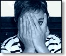
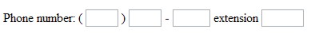

<!-- Geração automática de índice, inicio -->
<nav markdown="1">

## Índice de tópicos
{:.no_toc}

1. Indice de Tópicos. Esta linha será substituída
{:toc}

</nav>
<!-- Geração automática de índice, fim -->

<style>
/*
  NOTA: tags styles dentro do corpo de forma provisória. Melhorar no futuro (fititnt, 2016-09-22 22:59)
*/
.programlisting {
    border: 1px dashed #990000;
    border-radius: 4px;
    background-color: #ffffc1;
    width: auto;
    margin: 0 0 1em 0;
    padding: 2px;
    overflow: auto;
}
.note {
    background-color: #F1F5F7;
    border: 1px solid #CCCCCC;
}
.important, .tip, .note, .example {
    padding: 4px 1.5em 0px 1.5em;
    margin: 1em auto 1em auto;
    width: 85%;
    border-radius: 4px;
}
.note .title {
    background: url(media/bg.png) 0px -1800px no-repeat;
}
.important .title, .tip .title, .note .title, .example .title {
    padding: 3px 0 15px 35px;
    display: block;
    font-size: 1.25em;
    font-family: 'Kameron',Georgia,Times,serif;
}
.important {
    background-color: #fafaae;
    border: 1px solid #CCCCCC;
}
.important .title {
    background: url(media/bg.png) 0px -1600px no-repeat;
}
.important, .tip, .note, .example {
    padding: 4px 1.5em 0px 1.5em;
    margin: 1em auto 1em auto;
    width: 85%;
    border-radius: 4px;
}
.programlisting  code {
  background-color: transparent;
}
h3 code {
  font-size: 26px;
  font-weight: 400;
}
h4 code {
  margin-top: 1em;
  font-size: 20px;
  font-weight: 400;
}

</style>


Introdução
------------

<span style="float: right;margin: 8px 0px 1px 10px;"></span>Existem
casos pontuais em que o conteúdo deve ser disponibilizados para usuários de leitor de tela,
mas escondido de utilizadores normovisuais. Na maioria dos casos, se o conteúdo (principalmente
conteúdo que fornece a funcionalidade e interatividade) é importante o suficiente para
usuários de leitor de tela, ele provavelmente deve ser disponibilizado a todos os
usuários. Casos em que sugestões são verbosas ou instruções são fornecidas apenas por usuários de leitores
de tela são, provavelmente, um reflexo da má concepção e acessibilidade.
No entanto, existem alguns casos onde a informação é evidente visualmente, mas pode
não ser clara para os usuários de leitores de tela. Nestes casos, pode ser conveniente
marcação de conteúdo de uma forma que ele é lido por um leitor de tela, mas invisível para
utilizadores normovisuais.


Técnicas para o ocultar texto
--------------------------

Existem diversos mecanismos que podem ser usados para esconder o conteúdo. É importante
que a técnica a ser implementada resulte em o resultado desejado e a
acessibilidade.

### `visibility: hidden;` e/ou `display:none;`

Esses estilos vão ocultar o texto de todos os usuários. O texto é removido do fluxo visual
da página e é ignorado pelos leitores de tela. **Não use este CSS se
quiser que o conteúdo a ser lido por um leitor de tela. Mas USE isto para o conteúdo
que você não quer que sejam lidos por leitores de tela.**

### `width:0px`, `height:0px` e outras técnicas de tamanho 0 pixel

Tal como referido acima, devido a um elemento sem nenhuma altura ou largura é removido do fluxo da
página, a maioria dos leitores de tela irão ignorar este conteúdo. Largura e altura do HTML
pode dar o mesmo resultado. **Não redimensione o conteúdo a 0 pixels, se você deseja que o
conteúdo seja lido por um leitor de tela.** Conteúdo estilizado com `font-size:0px` ou
`line-height:0` podem funcionar, ainda que os elementos tomariam espaço horizontal
na tela. Todas estas técnicas podem implicar em penalizações de mecanismo de pesquisa já
que podem interpretado como maliciosas.


### `text-indent: -10000px;`


Esta abordagem move o conteúdo para 10000 pixels para esquerda - portanto, fora da tela
visível. O valor real tem pouca importância, desde que ele estiver posicionado fora da tela.
Os leitores de tela ainda vai ler o texto com esse estilo. No entanto, se um link ou elemento de formulário
recebe esse estilo, que pode resultar em um indicador de foco (as linhas pontilhadas
ou "formigas em marcha" que cercam um link focalizado) que se estende a partir de onde
o elemento deve ser localizado na página para o lugar é efectivamente localizado
(para a esquerda). Isto não é muito bonito. Essa abordagem também causa problemas em
idiomas da direita para a esquerda. Como tal, esta abordagem *pode* ser uma opção viável se
o elemento não contém elementos navegáveis, embora melhores técnicas estão
disponíveis.

### CSS clip

```css
position: absolute !important;
clip: rect(1px 1px 1px 1px); /* IE6, IE7 */
clip: rect(1px, 1px, 1px, 1px);
```

Uma técnica bastante moderna de usar CSS para ocultar ou cortar conteúdo que não se encaixa
em um 1 pixel área visível vai essencialmente esconder o conteúdo de forma visível,
mas ainda permitir que ele seja lido por leitores de tela modernos.

### Posicionamento absoluto de conteúdo fora da tela

Usar CSS para mover elementos ocultos para uma posição fora da tela é geralmente aceita
como o método mais útil e acessível de esconder o conteúdo visualmente.


Colocar conteúdo fora da tela
------------------------------

A seguir estão os estilos recomendados para esconder visualmente conteúdos que serão lidos
por um leitor de tela.


```css
.hidden {
    position:absolute;
    left:-10000px;
    top:auto;
    width:1px;
    height:1px;
    overflow:hidden;
}
```

A classe CSS .hidden deve então ser referenciada no interior da tag do
elemento a ser escondido, como mostrado:


```html
<div class="hidden">Este texto está ocultado.</div>
```

Usuários normovisuais não verão este conteúdo ocultado. Ele vai estar fora de seu
alcance de visão - bem escondida à esquerda da janela visível do navegador. Usuários
de leitores de tela terão acesso ao conteúdo como se não estivesse escondido.
Os leitores de tela podem ler o conteúdo normalmente, ignorando completamente
os estilos usados nesta técnica.

Vamos analisar os estilos em detalhe.

`position:absolute;` diz ao navegador para remover o elemento do fluxo da página
e começar a posicioná-lo. `left:-10000px;` move o conteúdo 10000 pixels para
esquerda. `top:auto;` diz ao navegador para posicionar o conteúdo verticalmente no
mesmo local estava originalmente. Omitir `top` pode resultar que o estilo `left`
seja ignorado em alguns casos e navegadores. Em suma, esta parte do filme de código do elemento 10000 pixels em linha reta para a esquerda. Em suma, esta parte de código move o elemento 10000 pixels em
linha reta para a esquerda.


`width:1px; height:1px; overflow:hidden;` informa o navegador para fazer o elemento
no tamanho 1px por 1px para esconder visualmente tudo o que não se encaixa nestas
dimensões. Enquanto isto é provavelmente um exagero e provavelmente poderia
ser omitido na maioria das vezes, tem alguns casos onde o posicionamento poderia
estar desabilitado, enquanto todos os demais estilos estão habilitados. Neste caso, o elemento irá
permanecer em sua posição original, mas vai tomar apenas 1 pixel de espaço.


<div class="note" markdown="1">
<div class="title">Nota</div>

Algumas vezes é recomendado posicionar elemento usando `left:0px; top:-500px` (ou
simiar). Enquanto isso funciona através do posicionamento o conteúdo acima do topo da página,
se o elemento oculto contém um link ou elemento de formulário, ao receber o foco do teclado,
o navegador tenta rolar para o elemento - então rolando o navegador para o topo da página.
Isso poderia resultar em confusão para os usuários de
teclado normovisuais. Ao posicionar directamente para a esquerda, o navegador não rolará
para o início da página. **Deve notar-se que, devido a links e os elementos de formulário
proporcionar funcionalidade, eles raramente devem ser escondidos dos utilizadores normovisuais.
Usuários com visão não serão capazes de ver que elemento atualmente tem o focodevido ele
está escondido fora da tela.**

</div>

Exemplos
--------


<div class="important">
<div class="title">Importante!</div>

Em geral, o conteúdo só deve ser escondido dos usuários com visão e disponibilizados
para os usuários de leitores de tela quando o conteúdo é evidente visualmente, mas não aparente para
os usuários de leitores de tela.

</div>

### Sinais e indicadores de instrução

<!--
  @fititnt após esses parágrafos, o ideal é rushar e fazer o caminho de migalhas
           e o pular para conteúdo nos sites da WebIWG. Mais prático do que
           convencer a pessoa a visitar o site original (fititnt, 2016-09-25 15:57)

-->

Em primeiro lugar, a caixa de texto de pesquisa na parte topo da página tem um rótulo oculto
imediatamente antes dele. É evidente visualmente que a caixa de texto é para procurar devido à
apresentação e no botão de pesquisa, mas um leitor de tela requer um rótulo para o
campo de texto. Como tal, nós fornecemos um rótulo, mas o escondemos visualmente.
Em segundo lugar, o caminho-de-pão (do inglês <em lang="en">breadcumb</em>) na parte superior da página é uma convenção de design comum.
A maioria dos usuários da Internet compreendem a convenção e podem identificar o caminho-de-pão visualmente.
Devido o leitor de tela acessar os links de navegação e conteúdo de forma linear,
pode não ser evidente para eles que é caminho-de-pão antes de lerem
uma parte dele. Como tal, nós adicionamos o texto oculto de "Você está aqui:" pouco antes de caminho-de-pão.


Você pode ver tudo isso de texto oculto, desativando estilos para esta página.
**Lembre-se, todo o conteúdo oculto visualmente com CSS ficará visível se estilos
são desativados.**

### Links "Ir para o conteúdo principal"

[Links "Ir para o conteúdo principal"](http://webaim.org/techniques/skipnav/) são um dos poucos lugares
onde acessibilidade tem um impacto direto e diferente do design visual. Para
poder ser útil, o link de "pular" deve ser o primeiro da página. Designers
podem não gostar da ideia de por um link como a primeira coisa na página -
em especial se o link não será usado pela maioria dos
visitantes do site. Porém, esconder o link o faz inusável para usuários que enxergam e usam teclado -
um grupo de usuários que pode ter grande benefício com este link.

Uma forma de conciliar o impacto de que os links "que pulam" tem no design visual com
as necessidades dos usuários e usuários de leitores de de tela com dificuldades de mobilidade é a
utilização de uma técnica que esconde o "pular para o conteúdo principal" até que o usuário pressione a tecla <kbd>tab</kbd>. Quando o link recebe o foco, a ligação torna-se visível para os utilizadores que enxergam. Isso
permitiria que os usuários de teclado cegos ou normovisuais tirem proveito da funcionalidade do link.

Para conseguir isto, dois estilos são criados - um para o elemento `<a>`
e outro para a pseudo-classe `a:focus`. O estilo criado para pseudo classe `a:focus`,
será ativo apenas quando o usuário pressionar <kbd>Tab</kbd> para ver o link (i.e., ele tem foco), e o
link irá voltar a ter seu estilo padrão (i.e., ele vai vai voltar a ser escondido fora da tela
novamente) quando o usuário pressionar <kbd>Tab<kbd> novamente para sair do link.

```css
#skip a {
    position:absolute;
    left:-10000px;
    top:auto;
    width:1px;
    height:1px;
    overflow:hidden;
}
#skip a:focus {
    position:static;
    width:auto;
    height:auto;
}
```

Os estilos devem ser aplicados a um link de "pular" (em inglês <em lang="en">skip</em>).


```html
<div id="skip"><a href="#content">Skip to Main Content</a></div>
```

Um ponto negativo desta abordagem, a nível conceitual, é que a subta
aparição de um link que estava previamente invisível é inesperada, e poderia
confundir o usuário de teclado que enxerga. O link também deve ser estilizado claramente para ficar
aparente. Estes não são problemas para leitores os leitores de tela ou usuários que usam mouse
porque eles nunca verão este link.

### Other implementations

Form controls are sometimes presented visually so that text is visually
associated as the label for multiple controls. Consider data entry where one
"First name" text might describe the function of multiple text boxes that appear
below it. Sometimes tables are used for these presentations. Alternatively,
sometimes one control may be labeled by multiple items of text, such as a
password field that is preceded by the word "Password:" and followed by the word
"Required". Using standard [form labelling](/webaim/tecnicas/formularios/#controles-de-de-formulrio-acessveis), there
is no way to associate one text item to multiple controls or multiple texts to
one form control. In these case, the appropriate labels could be provided in the
markup adjacent to their respective form elements, but hidden using the CSS
above.

A common example of this is when two or more text input elements are used for
phone numbers.



Most visual users in North America will understand that the individual text
input areas correspond to the different sections of standard phone numbers.
Screen reader users, however, may attempt to enter the entire phone number in
the first box. Confusion is likely when they discover that the box limits them
to only 3 characters or that there are additional unlabeled text boxes that
follow.

The most obvious workaround for this particular problem would be to combine all
of the text input boxes into a single text input box, and then provide the
appropriate label. However, off-screen labels for each distinct text box will
also ensure accessibility.

```html
 Phone number: (
   <label for="area" class="hidden">Area code</label>
   <input name="area" id="area" type="text" size="3" maxlength="3">
)…
```

The off-screen labels would, in this case, provide an adequate description for
screen reader users.

Note

In the example above, the `title` attribute could also be used to provide this
information. Information in the `title` attribute will be read by screen readers
when a label is not present. Additionally, `aria-labelledby` could be used to
provide multiple labels per input or multiple inputs per label.

Conclusion
----------

When the CSS techniques presented here are used to hide content, sighted users
will never know that the content is there at all (unless they disable styles).
Screen reader users, on the other hand, will never realize that this content is
invisible to sighted users. Both kinds of users will be able to use the content
intuitively, without having to adjust for either too much or too little
information in the markup. This can provide important contextual cues that are
otherwise impossible for screen reader users to grasp because of the visual
nature of these cues. When used judiciously, this technique can resolve some of
the tension between the demands of accessibility and the demands of visual
design. It is not the only technique or method of solving this problem, but it
is one that web developers can add to their list of possible solutions when the
need arises.


